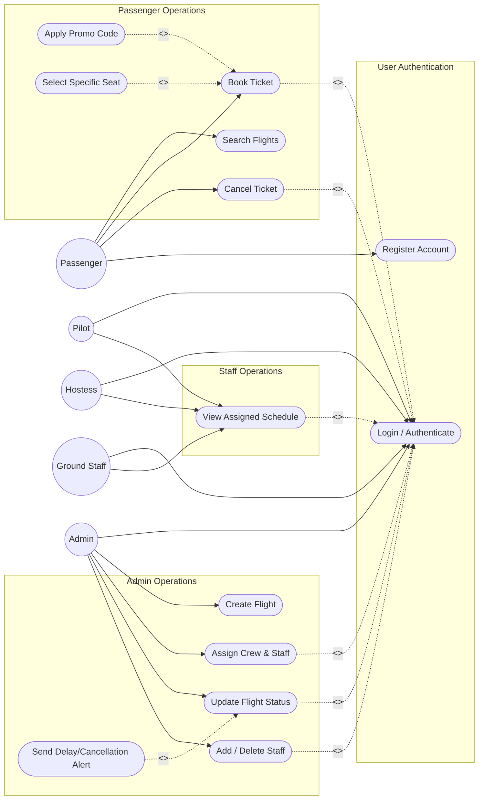
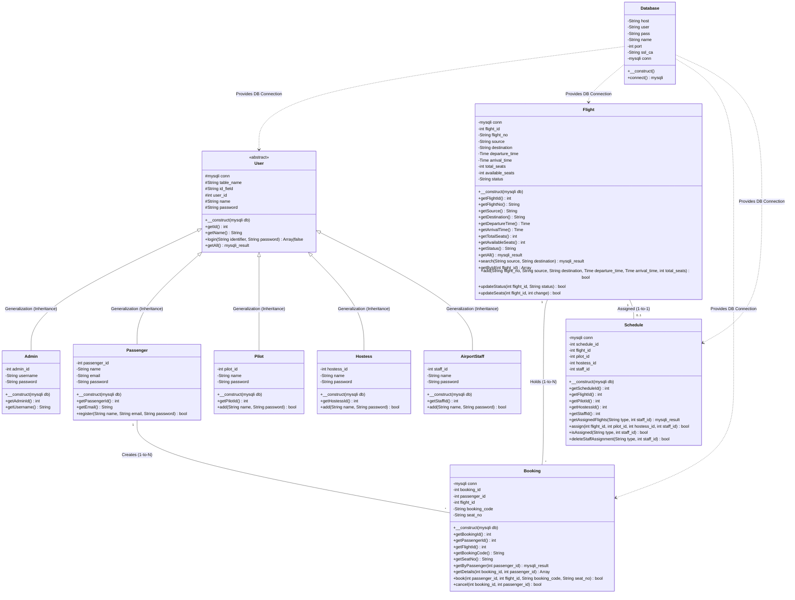
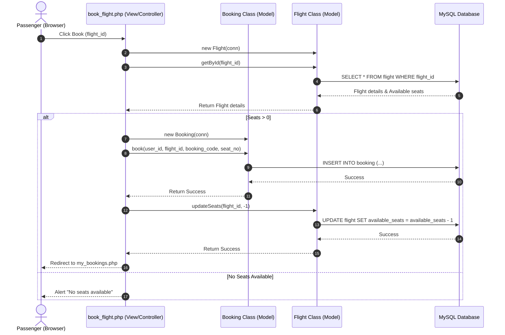

# ✈ Airline Management System (OOP & Cloud-Ready)

A modern, cloud-deployable Airline Management System built with PHP and MySQL, refactored into a solid **Object-Oriented Programming (OOP)** architecture. Designed to meet Software Engineering UML laboratory specifications, it features role-based access for Admins, Passengers, Pilots, Flight Hostesses, and Ground Staff.

---

## 🌟 Features & Roles
*   **Passenger**: Search flights, book tickets, view bookings, and cancel tickets.
*   **Admin**: Add/delete staff, create flights, assign crew schedules, and manage flight statuses.
*   **Crew (Pilots/Hostesses/Ground Staff)**: Log in and view personalized flight schedules.

---

## 🏗️ Object-Oriented Architecture (OOP)

The codebase has been refactored from procedural queries into modular classes inside the `api/classes/` directory. An autoloader (`api/autoload.php`) dynamically loads classes as needed.

### Core Classes:
1.  **`Database`**: Wraps the connection handler, supporting standard credentials, dynamic environment variables, and secure SSL connections.
2.  **`User` (Abstract Base Class)**: Encapsulates common user properties and actions like authentication (`login()`) and retrieving user logs (`getAll()`).
3.  **`Passenger` (Inherits `User`)**: Adds passenger-specific features like user registration (`register()`).
4.  **`Admin` (Inherits `User`)**: Implements admin role scopes.
5.  **`Pilot` / `Hostess` / `AirportStaff` (Inherit `User`)**: Standardizes crew representation and handles onboarding (`add()`).
6.  **`Flight`**: Manages routes, capacity, updates, and availability queries.
7.  **`Booking`**: Coordinates passenger ticket reservation and cancellation logs.
8.  **`Schedule`**: Handles pilot/hostess/staff flight scheduling assignments.

---

## 📊 UML Diagrams (Mermaid)

### 1. Use Case Diagram
This diagram outlines the interactions between different roles (Actors) and the system.

### 📚 Relationship Descriptions (for Lab Work)
*   **`<<include>>`**: Represents mandatory helper use cases. For instance, **Book Ticket** or **Cancel Ticket** cannot be performed without first completing the **Login / Authenticate** usecase.
*   **`<<extend>>`**: Represents optional/conditional behaviors. For example:
    *   Applying a promo code or picking a specific seat optionally extends the booking process.
    *   Sending alerts only extends the status update process if the flight is marked as **Delayed** or **Cancelled**.

---

### 2. Class Diagram
Illustrates the structural inheritance, encapsulation, and complete entity attributes (including Primary Keys: `admin_id`, `passenger_id`, `pilot_id`, `hostess_id`, `staff_id`, `flight_id`, `booking_id`, `schedule_id`). Each class is represented in a distinct, self-contained box detailing its attributes (access modifiers & types) and functionalities (methods & parameters).

#### 🛡️ Verification of OOP Architecture Principles:
1. **Abstraction**: The base `User` class is marked as `abstract` (located in [`api/classes/User.php`](file:///C:/Users/savan_17520ch/Airline/api/classes/User.php)), hiding database query complexity while serving as a contract for sub-user types.
2. **Inheritance**: `Admin`, `Passenger`, `Pilot`, `Hostess`, and `AirportStaff` extend `User`, inheriting shared authentication (`login()`) and listing (`getAll()`) methods.
3. **Encapsulation**: All database properties (`$conn`, `$table_name`, `$id_field`) are declared as `protected` (`#`) or `private` (`-`), preventing direct external mutation.
4. **Polymorphism**: The `login()` method dynamically adapts query logic depending on the child class's `$table_name` property (`email` for Passengers, `username` for Admins, `name` for Crew).
5. **Autoloading**: All OOP classes are dynamically loaded on demand via [`api/autoload.php`](file:///C:/Users/savan_17520ch/Airline/api/autoload.php) using `spl_autoload_register()`.

---

### 3. Sequence Diagram (Flight Booking Scenario)
Illustrates how the view layer, model layer, and database interact during a booking process.

---

## 📋 Use Case Specifications

### UC1: Login / Authenticate
*   **Use Case ID**: UC1
*   **Brief Description**: Validates user credentials and initiates a session based on the user's role.
*   **Primary Actor**: Any User (Passenger, Admin, Pilot, Hostess, Ground Staff)
*   **Secondary Actor**: Database System
*   **Preconditions**: User must have a registered account and navigate to the login page.
*   **Main Flow**:
    1. The use case starts when the user inputs their username (or email) and password, then submits the login form.
    2. The system instantiates the corresponding user class (`Admin`, `Passenger`, `Pilot`, `Hostess`, `AirportStaff`).
    3. The system executes the `login()` method, querying the database to verify the credentials.
    4. The database verifies the credentials and returns the user's details.
    5. The system saves the credentials in the session and redirects the user to their dashboard.
*   **Postconditions**: The user is authenticated and logged into the application.
*   **Alternative Flow**:
    *   *Condition*: If the database query does not return any matching records (wrong credentials).
    *   *Alternative Flow*: The system displays a "Login Failed" error message and prompts the user to try again.

---

### UC2: Search Flights
*   **Use Case ID**: UC2
*   **Brief Description**: Allows passengers to search for flights between a source and a destination.
*   **Primary Actor**: Passenger
*   **Secondary Actor**: Database System
*   **Preconditions**: Passenger must be logged in.
*   **Main Flow**:
    1. The use case starts when the passenger navigates to the "Search Flights" page.
    2. The passenger enters a source and a destination airport, and clicks "Search".
    3. The system invokes the `search()` method on the `Flight` class.
    4. The system queries the `flight` table for matching records.
    5. The system displays a list of available flights with schedule details and available seats.
*   **Postconditions**: The passenger views a list of matching flights.
*   **Alternative Flow**:
    *   *Condition*: If no flights match the searched criteria.
    *   *Alternative Flow*: The system displays a message stating "No flights found".

---

### UC3: Book Ticket
*   **Use Case ID**: UC3
*   **Brief Description**: Reserves a seat for a passenger on a specific flight.
*   **Primary Actor**: Passenger
*   **Secondary Actor**: Database System
*   **Preconditions**: Passenger must be logged in, and select a flight from search results.
*   **Main Flow**:
    1. The use case starts when the passenger clicks the "Book" button next to a flight.
    2. The system checks if the flight's `available_seats` is greater than 0.
    3. The system generates a unique booking code and seat number.
    4. The system invokes the `book()` method on the `Booking` class to insert the record.
    5. The system updates the `flight` table, decrementing the `available_seats` count by 1.
    6. The system redirects the passenger to their bookings dashboard.
*   **Postconditions**: A new booking is created, and the flight's available capacity is reduced.
*   **Alternative Flow**:
    *   *Condition*: If the flight capacity is full (`available_seats` <= 0), or if the flight status is "Cancelled" or "Reached Destination".
    *   *Alternative Flow*: The system alerts the passenger that booking is not possible and redirects them back to the search page.

---

### UC4: Cancel Ticket
*   **Use Case ID**: UC4
*   **Brief Description**: Cancels a passenger's booking and frees up their seat.
*   **Primary Actor**: Passenger
*   **Secondary Actor**: Database System
*   **Preconditions**: Passenger must be logged in and have an active booking on an upcoming flight.
*   **Main Flow**:
    1. The use case starts when the passenger clicks "Cancel" next to a booking in the dashboard.
    2. The system invokes the `cancel()` method on the `Booking` class.
    3. The system deletes the booking record.
    4. The system updates the `flight` table, incrementing the `available_seats` count by 1.
    5. The system redirects the passenger back to the updated bookings dashboard.
*   **Postconditions**: The booking is removed, and the flight's available capacity is restored.
*   **Alternative Flow**:
    *   *Condition*: If the flight status is already "Cancelled" or "Reached Destination".
    *   *Alternative Flow*: The cancel action is disabled on the UI, displaying "Reimbursement Pending" or "Completed" instead.

---

### UC5: View Assigned Schedule
*   **Use Case ID**: UC5
*   **Brief Description**: Allows crew members to view their assigned flight schedules.
*   **Primary Actor**: Crew (Pilot, Hostess, Ground Staff)
*   **Secondary Actor**: Database System
*   **Preconditions**: Crew member must be logged in.
*   **Main Flow**:
    1. The use case starts when the crew member accesses their dashboard.
    2. The system queries the `staff_schedule` table via the `Schedule` class.
    3. The system joins the database query with flight details.
    4. The system displays a table of assigned flights with departure/arrival times.
*   **Postconditions**: Crew member views their assigned schedule.
*   **Alternative Flow**:
    *   *Condition*: If the crew member has no assigned flights in the schedule.
    *   *Alternative Flow*: The system displays an empty table stating no schedules are currently assigned.

---

### UC6: Create Flight
*   **Use Case ID**: UC6
*   **Brief Description**: Creates a new flight route.
*   **Primary Actor**: Admin
*   **Secondary Actor**: Database System
*   **Preconditions**: Admin must be logged in.
*   **Main Flow**:
    1. The use case starts when the admin opens the "Add Flight" form.
    2. The admin inputs the flight number, route (source/destination), times, and total seats.
    3. The admin clicks the submit button.
    4. The system invokes the `add()` method on the `Flight` class to insert the record.
    5. The system displays a success confirmation message.
*   **Postconditions**: A new flight is registered in the database.
*   **Alternative Flow**:
    *   *Condition*: If the database insertion fails (e.g., duplicate flight number).
    *   *Alternative Flow*: The system displays a "Failed to add flight" error message.

---

### UC7: Assign Crew & Staff
*   **Use Case ID**: UC7
*   **Brief Description**: Assigns crew members to a flight schedule.
*   **Primary Actor**: Admin
*   **Secondary Actor**: Database System
*   **Preconditions**: Admin must be logged in, and valid flight and crew records must exist.
*   **Main Flow**:
    1. The use case starts when the admin opens the "Assign Staff" form.
    2. The admin selects a flight, pilot, hostess, and ground staff member.
    3. The admin clicks the "Assign" button.
    4. The system invokes the `assign()` method on the `Schedule` class.
    5. The system inserts or updates the schedule record in the database.
    6. The system displays a success message.
*   **Postconditions**: Crew members are mapped to the flight schedule.
*   **Alternative Flow**:
    *   *Condition*: If the database query fails.
    *   *Alternative Flow*: The system displays a "Failed to assign staff" error message.

---

### UC8: Update Flight Status
*   **Use Case ID**: UC8
*   **Brief Description**: Updates status details for active flights.
*   **Primary Actor**: Admin
*   **Secondary Actor**: Database System
*   **Preconditions**: Admin must be logged in, and the flight must exist.
*   **Main Flow**:
    1. The use case starts when the admin opens the "Update Flight Status" form.
    2. The admin selects a flight and updates its status (On Time, Delayed, Cancelled, Reached Destination).
    3. The admin clicks the "Update Status" button.
    4. The system invokes the `updateStatus()` method on the `Flight` class.
    5. The system redirects the admin back with a success message.
*   **Postconditions**: The flight status is updated in the database.
*   **Alternative Flow**:
    *   *Condition*: If the update query fails.
    *   *Alternative Flow*: The system displays a failure message.

---

### UC9: Add / Delete Staff
*   **Use Case ID**: UC9
*   **Brief Description**: Admin registers new staff members or deletes existing ones.
*   **Primary Actor**: Admin
*   **Secondary Actor**: Database System
*   **Preconditions**: Admin must be logged in.
*   **Main Flow**:
    1. The use case starts when the admin navigates to the "Add Staff" or "Delete Staff" page.
    2. The admin inputs details for a new member or selects an existing member to delete.
    3. The system checks if the staff member is assigned to a flight using the `Schedule` class.
    4. The system deletes the staff member if they are not assigned.
    5. The system displays a success message.
*   **Postconditions**: The staff member is created or deleted.
*   **Alternative Flow**:
    *   *Condition*: If the admin attempts to delete a staff member who is currently assigned to a flight.
    *   *Alternative Flow*: The system blocks the deletion and displays the message "Cannot delete: Staff is assigned to a flight".

---

## 🚀 Deployment Instructions

### 1. Database Setup (Clever Cloud / Railway / Local)
1.  Run the [schema.sql](schema.sql) file inside your MySQL instance to construct tables and generate the default administrator login.
    *   **Default Admin Credentials**: Username: `admin` | Password: `admin123`

### 2. Vercel Cloud Deployment
This project is configured with a community PHP runtime:
1.  Push the code to your GitHub repository.
2.  Link the repository inside Vercel.
3.  Add the following **Environment Variables** in Vercel settings under **Settings** -> **Environment Variables**:
    *   `DB_HOST` (Cloud Database Hostname)
    *   `DB_PORT` (Database Port, e.g. `3306` or Railway proxy port)
    *   `DB_NAME` (Database Name)
    *   `DB_USER` (Database Username)
    *   `DB_PASSWORD` (Database Password)
