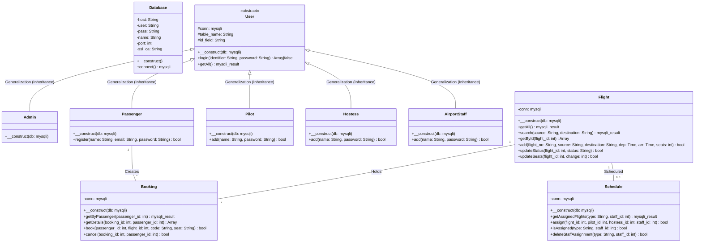
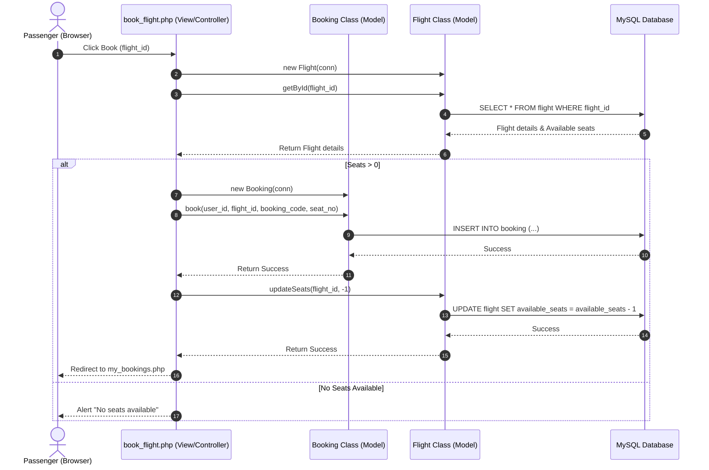

# ✈ Airline Management System (OOP & Cloud-Ready)

A modern, cloud-deployable Airline Management System built with PHP and MySQL, refactored into a solid **Object-Oriented Programming (OOP)** architecture. Designed to meet Software Engineering UML laboratory specifications, it features role-based access for Admins, Passengers, Pilots, Flight Hostesses, and Ground Staff.

---

## 🌟 Features & Roles
*   **Passenger**: Search flights, book tickets, view bookings, and cancel tickets.
*   **Admin**: Add/delete staff, create flights, assign crew schedules, and manage flight statuses.
*   **Crew (Pilots/Hostesses/Ground Staff)**: Log in and view personalized flight schedules.

---

## 🏗️ Object-Oriented Architecture (OOP)

The codebase has been refactored from procedural queries into modular classes inside the `api/classes/` directory. An autoloader (`api/autoload.php`) dynamically loads classes as needed.

### Core Classes:
1.  **`Database`**: Wraps the connection handler, supporting standard credentials, dynamic environment variables, and secure SSL connections.
2.  **`User` (Abstract Base Class)**: Encapsulates common user properties and actions like authentication (`login()`) and retrieving user logs (`getAll()`).
3.  **`Passenger` (Inherits `User`)**: Adds passenger-specific features like user registration (`register()`).
4.  **`Admin` (Inherits `User`)**: Implements admin role scopes.
5.  **`Pilot` / `Hostess` / `AirportStaff` (Inherit `User`)**: Standardizes crew representation and handles onboarding (`add()`).
6.  **`Flight`**: Manages routes, capacity, updates, and availability queries.
7.  **`Booking`**: Coordinates passenger ticket reservation and cancellation logs.
8.  **`Schedule`**: Handles pilot/hostess/staff flight scheduling assignments.

---

## 📊 UML Diagrams (Mermaid)

### 1. Use Case Diagram
This diagram outlines the interactions between different roles (Actors) and the system.

```mermaid
leftClassDir
rect "Airline Management System"
  usecase "Register & Login" as UC1
  usecase "Search Flights" as UC2
  usecase "Book Ticket" as UC3
  usecase "Cancel Ticket" as UC4
  usecase "View Assigned Schedule" as UC5
  usecase "Create Flight" as UC6
  usecase "Assign Crew & Staff" as UC7
  usecase "Update Flight Status" as UC8
  usecase "Add / Delete Staff" as UC9
end

Passenger --> UC1
Passenger --> UC2
Passenger --> UC3
Passenger --> UC4

Pilot --> UC1
Pilot --> UC5

Hostess --> UC1
Hostess --> UC5

GroundStaff --> UC1
GroundStaff --> UC5

Admin --> UC1
Admin --> UC6
Admin --> UC7
Admin --> UC8
Admin --> UC9
```

---

### 2. Class Diagram
Illustrates the structural inheritance, encapsulation, and relationships of the object-oriented design.



---

### 3. Sequence Diagram (Flight Booking Scenario)
Illustrates how the view layer, model layer, and database interact during a booking process.



---

## 🚀 Deployment Instructions

### 1. Database Setup (Clever Cloud / Railway / Local)
1.  Run the [schema.sql](schema.sql) file inside your MySQL instance to construct tables and generate the default administrator login.
    *   **Default Admin Credentials**: Username: `admin` | Password: `admin123`

### 2. Vercel Cloud Deployment
This project is configured with a community PHP runtime:
1.  Push the code to your GitHub repository.
2.  Link the repository inside Vercel.
3.  Add the following **Environment Variables** in Vercel settings under **Settings** -> **Environment Variables**:
    *   `DB_HOST` (Cloud Database Hostname)
    *   `DB_PORT` (Database Port, e.g. `3306` or Railway proxy port)
    *   `DB_NAME` (Database Name)
    *   `DB_USER` (Database Username)
    *   `DB_PASSWORD` (Database Password)
